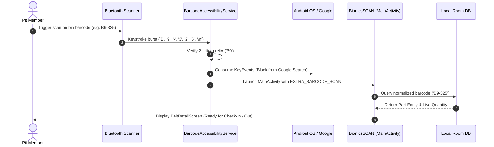

# BionicsSCAN: FRC Inventory Management System

[](https://www.android.com/)
[](https://kotlinlang.org/)
[](https://developer.android.com/jetpack/compose)
[-orange.svg)](https://developer.android.com/training/data-storage/room)
[](https://inventory-backend.team4909.org/api/)
[](https://team4909.org)

**BionicsSCAN** is a high-performance, mobile-first inventory management and hardware scanning platform engineered specifically for **FIRST Robotics Competition (FRC)** teams. Designed to thrive in high-tempo pit environments, BionicsSCAN combines rapid **physical hardware barcode scanning (Bluetooth/USB HID)** with an **offline-first local database** and real-time cloud synchronization via the **Bionic Inventory REST API**.

---

## 📑 Table of Contents

1. [Key Capabilities](#-key-capabilities)
2. [Supported Component Categories & Barcode Schema](#-supported-component-categories--barcode-schema)
3. [Hardware Barcode Scanner Integration](#-hardware-barcode-scanner-integration)
   - [How It Works](#how-it-works)
   - [Global Background Scanning (Anywhere on Device)](#global-background-scanning-anywhere-on-device)
   - [Setup Guide for Android 13, 14, and 15](#setup-guide-for-android-13-14-and-15)
4. [Software Architecture & Data Flow](#-software-architecture--data-flow)
   - [Offline-First Sync Engine](#offline-first-sync-engine)
   - [Transaction Queue & Reconciliation](#transaction-queue--reconciliation)
5. [In-App Camera & Label Printing](#-in-app-camera--label-printing)
6. [Tech Stack](#-tech-stack)
7. [Getting Started & Build Instructions](#-getting-started--build-instructions)
   - [Prerequisites](#prerequisites)
   - [Configuration (`local.properties`)](#configuration-localproperties)
   - [Building & Installing to Device](#building--installing-to-device)
8. [API & Data Schema Specification](#-api--data-schema-specification)
9. [Troubleshooting & FAQs](#-troubleshooting--faqs)

---

## ⚡ Key Capabilities

* **Global Background Hardware Scanning**: Scan a physical label using a paired Bluetooth or USB scanner from **anywhere on the device** (Home screen, browser, or backgrounded app). BionicsSCAN immediately intercepts the scan burst, consumes the keystrokes (preventing unwanted Google search submissions), wakes the device, and opens the exact item.
* **Instant Category Auto-Routing**: Automatically switches category tabs (`Belt 9mm`, `Belt 15mm`, `Gear`, `Sprocket`) based on the 2-letter barcode prefix and navigates directly into the item's detail view.
* **100% Offline-First Architecture**: Pit crew members can check in (`+1`) and check out (`-1`) components without an active internet connection. All actions are committed atomically to a local SQLite database powered by **Room** and queued for automatic replay via **WorkManager**.
* **Real-Time Bi-Directional Cloud Sync**: Continuous polling and instant push reconciliation with the centralized **Bionic Inventory REST API** to keep all laptops, tablets, and phones synchronized across the pit.
* **Batch Barcode Label Generator**: Built-in PDF label generation with standard Avery/bin dimensions, allowing single-click printing or PDF sharing for all inventory items in a category.
* **Built-in Camera Scanning (ML Kit)**: High-speed Code 128 scanner powered by **Google ML Kit Vision** and **CameraX** with live viewport alignment guides.
* **Live Dashboard Analytics**: Instant metrics displaying total item sizes, total on-hand units, low-stock thresholds, and out-of-stock alerts.

---

## 🏷️ Supported Component Categories & Barcode Schema

BionicsSCAN manages the standard mechanical motion transmission library used in FRC drivetrains, arms, elevators, and shooters:

| Category | Identifier | Prefix | Example Barcode | Formats Supported |
| :--- | :--- | :--- | :--- | :--- |
| **Belt 9mm** (HTD 5mm) | `BELT_9MM` | `B9-` | `B9-325` | `B9-325`, `B9325`, `b9 325` |
| **Belt 15mm** (HTD 5mm) | `BELT_15MM` | `B15-` / `B1-` | `B15-450` | `B15-450`, `B15450`, `b15 450` |
| **Gears** (20DP / Tooth Count) | `GEAR` | `GR-` | `GR-48` | `GR-48`, `GR48`, `gr 48` |
| **Sprockets** (#25 / #35 Chain) | `SPROCKET` | `SP-` | `SP-18` | `SP-18`, `SP18`, `sp 18` |

> [!NOTE]
> The database lookup engine uses normalized character hashing. Barcodes are recognized and resolved whether they contain hyphens, spaces, or lowercase letters.

---

## 🔫 Hardware Barcode Scanner Integration

### How It Works

Physical handheld scanners (e.g. **Zebra DS3678**, **Honeywell**, **Inateck**, **Eyoyo**, **Symcode**) operate as Human Interface Devices (HID / Bluetooth Keyboards). When a barcode is read, the scanner sends a rapid burst of keystrokes followed by an `Enter` or `Tab` terminator.



### Global Background Scanning (Anywhere on Device)

BionicsSCAN includes a dedicated **`BarcodeAccessibilityService`**:
1. **Prefix Detection**: It inspects incoming hardware keystrokes. When the first two characters match a known prefix (`B9`, `B1`, `GR`, `SP`), it locks into scan mode.
2. **Zero-Leak Keystroke Consumption**: All subsequent keystrokes and the terminating `Enter` are consumed, preventing accidental text insertion or search submissions into Google Search, browsers, or other apps.
3. **Auto-Flush Safety**: A 250ms burst timeout guarantees that even if a scanner fails to send a terminating `Enter` key, the scan is still cleanly recognized and delivered.

### Setup Guide for Android 13, 14, and 15

Android 13+ enforces a security restriction called **Restricted Settings** on sideloaded/developer apps. To enable background hardware scanning:

#### Automatic One-Click Setup (via ADB):
```bash
adb shell appops set com.bionics.BionicsSCAN ACCESS_RESTRICTED_SETTINGS allow
adb shell settings put secure enabled_accessibility_services com.bionics.BionicsSCAN/com.bionics.BionicsSCAN.service.BarcodeAccessibilityService
adb shell settings put secure accessibility_enabled 1
```

#### Manual Setup on Tablet/Phone:
1. Go to **Settings $\rightarrow$ Apps $\rightarrow$ BionicsSCAN**.
2. Tap the **three vertical dots (⋮)** in the top-right corner.
3. Tap **Allow restricted settings** (confirm with your tablet PIN/fingerprint).
4. Go to **Settings $\rightarrow$ Accessibility $\rightarrow$ BionicsSCAN Background Scanner** and toggle it **ON**.

---

## 🏗️ Software Architecture & Data Flow

```
com.bionics.BionicsSCAN
├── data
│   ├── Belt.kt                       # Domain UI Model
│   ├── InventoryMappers.kt            # DTO <-> Entity <-> Domain Mappers
│   ├── InventoryRepository.kt        # Single Source of Truth Repository
│   └── InventoryType.kt              # BELT_9MM, BELT_15MM, GEAR, SPROCKET
├── database
│   ├── BionicsDatabase.kt            # Room Database Configuration
│   ├── InventoryDao.kt               # Local Part DAO (with normalized lookup)
│   ├── InventoryEntity.kt            # Cached Part Table
│   ├── PendingTransactionDao.kt      # Offline Replay Transaction Queue
│   └── PendingTransactionEntity.kt   # Queued Checkout/Checkin Records
├── network
│   ├── BionicInventoryApi.kt         # Retrofit REST Interface
│   └── BionicInventoryDtos.kt        # JSON Serialization DTOs
├── scanner
│   ├── BarcodeScanner.kt             # CameraX + ML Kit View
│   └── HardwareBarcodeScanner.kt     # HID Burst Accumulator & Key Filter
├── service
│   └── BarcodeAccessibilityService.kt # System-Wide Keystroke Interceptor
├── sync
│   ├── SyncScheduler.kt              # WorkManager Replay & Polling Coordinator
│   └── SyncWorker.kt                 # Background Sync Execution Task
├── ui
│   ├── screens
│   │   ├── BarcodeLabelsScreen.kt    # PDF Label Generator & Print Engine
│   │   ├── BeltDetailScreen.kt       # Quantity Controls, Barcode View, History
│   │   ├── BeltListScreen.kt         # Main Dashboard, Tab Navigation, Metrics
│   │   ├── ScanScreen.kt             # Camera Viewfinder & Manual Lookup
│   │   └── StockFilterScreen.kt      # Low Stock & Out of Stock Filter Views
│   └── theme                         # Material 3 Color Schemes & Typography
└── viewmodel
    └── BeltViewModel.kt              # UI StateFlows, Search Filter, Sync Dispatcher
```

### Offline-First Sync Engine

1. **Immediate Local Execution**: When a user taps "+1" or "-1", the change is executed immediately in the local SQLite Room DB. The UI updates in <10ms.
2. **Transaction Queueing**: The action is recorded with a unique UUID, timestamp, delta (`+1`/`-1`), and sync status (`PENDING`) in the `pending_transactions` table.
3. **WorkManager Replay**: `SyncWorker` executes with network constraints. It replays queued transactions sequentially to `POST /api/parts/{id}/transactions`.
4. **Authoritative Reconciliation**: Once the queue is drained, the client requests `GET /api/parts` to reconcile authoritative counts from the cloud.

---

## 📷 In-App Camera & Label Printing

### Camera Scanner
* Powered by **CameraX** and **ML Kit**.
* Tuned for **Code 128** high-density barcodes.
* Includes battery-saving controls ("Start Camera" / "Stop Camera") and manual ID fallback.

### Batch Label Printing
* Generates vector-sharp Code 128 barcodes rendered via ZXing.
* Custom layout formatted for Avery multi-label sheets with part numbers, category tags, and tooth counts/lengths.
* Native integration with Android `PrintManager` (Direct WiFi / Bluetooth printing) and Android Share Sheet (Export PDF to Google Drive or email).

---

## 🛠️ Tech Stack

* **Language**: Kotlin 2.3+ (Coroutines, StateFlow, Kotlinx Serialization)
* **UI**: Jetpack Compose, Material 3, Compose Navigation
* **Local Persistence**: Android Room 2.6+ (KSP compiler)
* **Background Scheduling**: AndroidX WorkManager 2.11+
* **Networking**: Square Retrofit 2.9, OkHttp 4.12, Logging Interceptor
* **Computer Vision**: Google ML Kit Barcode Scanning 17.2, CameraX 1.3
* **Barcode Generation**: ZXing Core 3.5
* **Android Services**: Android Accessibility Service Framework

---

## 🚀 Getting Started & Build Instructions

### Prerequisites
* Android Studio Ladybug (2024.2+) or higher
* Android SDK 35 (Android 15)
* JDK 21 / 25
* Connected Android Device (Phone or Tablet) with Developer Mode & USB Debugging enabled

### Configuration (`local.properties`)
Create or edit `local.properties` in the root project directory:
```properties
sdk.dir=C:/Users/<your-user>/AppData/Local/Android/Sdk
BIONIC_INVENTORY_API_URL=https://inventory-backend.team4909.org/api/
BIONIC_INVENTORY_API_KEY=bio_prod_your_api_key_here
```

### Building & Installing to Device

#### Using Gradle Wrapper:

**Windows (PowerShell):**
```powershell
# Build and install debug APK directly to connected tablet/phone
.\gradlew.bat installDebug

# Start the application via ADB
adb shell am start -n com.bionics.BionicsSCAN/.MainActivity
```

**macOS / Linux:**
```bash
./gradlew installDebug
adb shell am start -n com.bionics.BionicsSCAN/.MainActivity
```

---

## 📡 API & Data Schema Specification

The client interfaces with the Bionic Inventory REST API using standard Bearer / API Key authentication:

### Endpoints

#### `GET /api/parts`
Fetches the complete active inventory catalog.
```json
[
  {
    "id": "051e3d46-72d3-4dd1-ae7b-97d21c97113b",
    "name": "9mm Belt 325mm",
    "mfgPartNumber": "B9-325",
    "description": "5mm HTD Pitch Timing Belt",
    "quantity": 12,
    "metadata": {
      "inventoryType": "BELT_9MM",
      "size": 325
    },
    "archivedAt": null
  }
]
```

#### `POST /api/parts/{id}/transactions`
Records a check-in, check-out, or count correction.
```json
{
  "delta": -1,
  "transactionType": "CHECK_OUT",
  "notes": "Pit checkout via BionicsSCAN"
}
```

---

## ❓ Troubleshooting & FAQs

### Q: Why does scanning on the home screen open Google Search instead of BionicsSCAN?
**A:** The **BionicsSCAN Background Scanner** accessibility service is turned off. Enable it in **Settings $\rightarrow$ Accessibility $\rightarrow$ BionicsSCAN Background Scanner**. If grayed out, first enable "Allow restricted settings" in App info (see [Setup Guide](#setup-guide-for-android-13-14-and-15)).

### Q: Can I scan barcodes while offline in the competition pit?
**A:** **Yes!** The app is 100% functional offline. All check-ins and check-outs are stored locally in Room DB and will automatically sync when a network connection is detected.

### Q: Does the app support non-hyphenated barcodes (e.g. `B9325` vs `B9-325`)?
**A:** **Yes.** The app normalizes all input strings by stripping hyphens and whitespace during search and barcode lookups.

---

*Engineered with pride by **FRC Team 4909 Bionics**.*  
*"Scanner for the pits, truth for the backend."*
